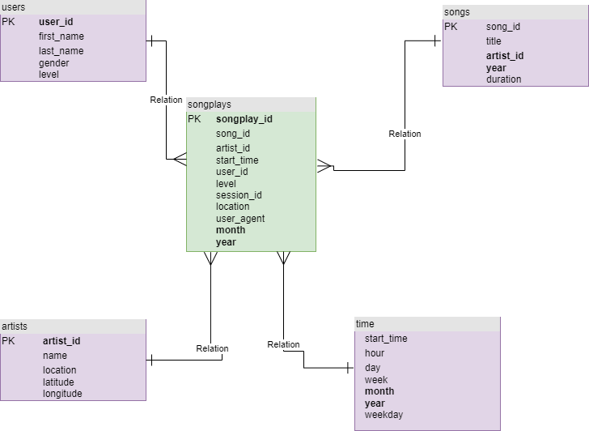

# Datalake

The purpose of this project is to build ETL by using Spark to process raw data from S3, The JSON data from S3 bucket will be loaded into DataFrame to transform before the data will being loaded into a star schema with fact and dimention tables in parquet format in S3. A star schema help to query quickly and aggregation are fast.

## How to run the Python scripts

Open terminal

### Run python script to execute ETL

`python3 etl.py`

Once run that file successfully, All data from S3 will be loaded into DataFrame and then Data will be transform and save into Fact & Dimention Tables in parquet format in s3. JSON song files are from `s3://udacity-dend/song_data` and JSON log files are from `s3://udacity-dend/log_data`.

## Star schema design

